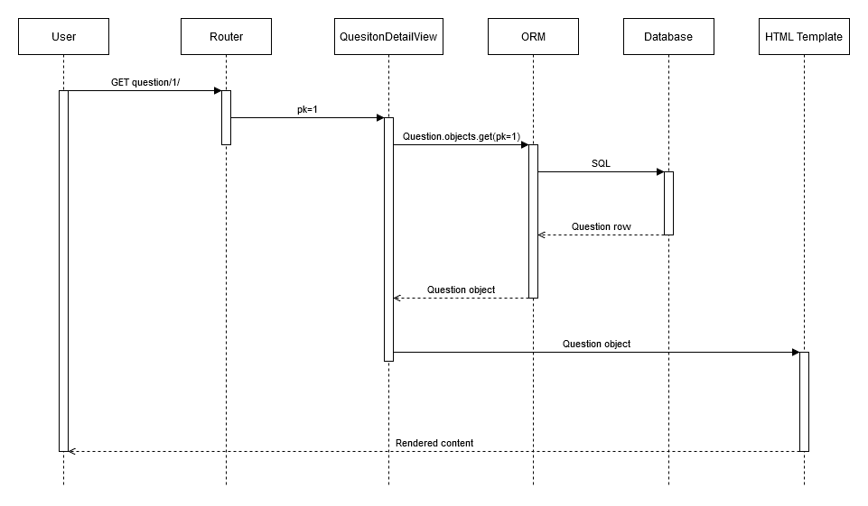

# StackOverflow Clone

Proiectul este o aplicatie web scrisa in Django precum StackOverflow cu elemente de gamification. 

Proiect pentru cursul Managementul si Organizarea Proiectelor Software. Realizat de Eduard-Cristian Podaru (Scrum Master), Cristina Enciu (Product Owner), Petru Popescu (Dezvoltator), Radu-Nicolae Trascalie (Dezvoltator)

Proiect pentru cursul Analiza si Modelarea Sistemelor Software. Realizat de Eduard-Cristian Podaru, Petru Popescu, Radu-Nicolae Trascalie

Am implementat:
- Inregistrare si autentificare
- Postare, editare, stergere de intrebari si raspunsuri cu sugestii in comentarii
- Un feed paginat cu cele mai recente intrebari
- Search pentru intrebari si raspunsuri
- Editor de rich text care permite utilizatorilor sa adauge intrebari si raspunsuri cu continut complex, inclusiv code blocks
- Sistem de upvote/downvote pentru intrebari, raspunsuri, comentarii
- Profil customizabil pentru fiecare utilizator
- Sistem care acorda badgeuri pentru useri care ating anumite milestones
- Unit tests
- Seeder pentru baza de date pentru a usura development
- Teste de acceptanta scrise cu Robot Framework
- Editor pentru scris si testat cod care permite rulare de cod arbitrar in Python, Java, C++
- Securizarea feature-ului de rulare de cod prin rularea intr-un docker container a codului care contine importuri, in functie de limbajul sau

## Setup
Pentru a porni aplicatia, trebuie instalate `requirements.txt`

```bash
pip install -r requirements.txt
```

Pentru a functiona integral feature-ul de code running, trebuie instalat si pornit Docker (Docker Desktop pentru Windows)

Optional, se poate da pull manual la imaginile de Docker folosite pentru functionalitatea de code running:

```bash
docker pull openjdk:23-jdk-slim gcc:14 python:3.10-slim
```
Altfel, se va da pull automat la prima rulare cu un anumit limbaj

Apoi se poate rula seederul pentru baza de date:

```bash
python manage.py seed
```

Apoi se poate porni aplicatia cu comanda:

```bash
python manage.py runserver
```

Pentru a rula unit testele:

```bash
python manage.py test sovf.tests
```

Pentru a rula testele de acceptanta, din directorul `robot_tests`:

```bash
python -m robot .
```

## Screenshots

### Feed-ul principal de intrebari


### Profil customizabil


### Creare de intrebari cu editor de rich text


### Interbare si raspunsuri


# Diagrame

## Diagrama Use-case

Diagrama generala a proiectului


## Diagrama de clase

Diagrama de clase pentru modelele din baza de date. Eduard-Cristian Podaru


## Diagrama de interactiune

Diagrama de interactiune care arata flow-ul logic si componentele parcurse cand se face un request pentru vizualizarea unei intrebari specifice (cu id 1). Eduard-Cristian Podaru



## Diagrama de deployment

Diagrama de deployment care arata componentele initiale dorite pentru proiect. Radu-Nicolae Trascalie


## Diagrama de activitate

Diagrama comportamentala de activitate pentru signup. Radu-Nicolae Trascalie


## Diagrama de activitate

Diagrama de activitate care reprezinta procesul pentru a pune o intrebare. Petru Popescu


## Diagrama de stare

Diagrama de stare care arata procesul de votare a unui utilizator pe o intrebare. Petru Popescu


# Cerintele proiectului

## Obiectiv
Facilitarea schimbului de cunostinte printr-o platforma de tip "Question - Answers" : Platforma permite
utilizatorilor sa se autentifice, sa adauge intrebari, sa raspunda la intrebari, sa sugereze modificari/imbunatatiri,
sa aleaga cel mai bun raspuns (doar utilizatorului care a adaugat intrebarea). Adaugarea de raspunsuri, sugestia de modificari si alegerea raspunsului ca fiind cel mai potrivit va aduce puncte utilizatorului; punctele contribuie la obtinerea de badge-uri.

## Cerinte Functionale
| Cerinta | Justificare |
| ------- | ------------- |
| Trebuie sa pot crea un cont | Pentru a accesa functionalitatile platformei |
| Trebuie sa pot schimba parola | Pentru a-mi mentine securitatea contului |
| Trebuie sa pot vizualiza si gestiona pagina de profil, inclusiv setarea unei imagini de profil | Pentru a-mi personaliza experienta |
Trebuie sa pot posta intrebari despre software engineering/programare Pentru a primi feedbackTrebuie sa pot raspunde la postarile altor utilizatori | Pentru a contribui la discutii |
| Trebuie sa pot vota pozitiv/negativ postarile si raspunsurile | Pentru a indica continutul util sau mai putin util. |
| Trebuie sa pot selecta cel mai bun raspuns | Pentru a evidentia cel mai util raspuns |
| Trebuie sa pot urmari postari | Pentru a primi notificari despre noi raspunsuri |
| Trebuie sa pot vedea un flux de intrebari recente pe pagina principala | Pentru a naviga cu usurinta printre discutiile actuale |
| Trebuie sa pot adauga blocuri de cod in intrebari/raspunsuri | Pentru formatarea raspunsurilor |
Trebuie sa pot castiga badge-uri pe baza activitatilor mele (raspunsuri, voturi, postari) | Pentru a fi recompensat pentru | participare |
| Trebuie sa pot vedea un clasament al utilizatorilor de top | Pentru a identifica cei mai activi contribuabili din comunitate |
| Trebuie sa pot rula fragmente de cod in cel putin 3 limbaje de programare | Pentru a testa solutiile |
| Trebuie sa pot vizualiza grafice cu activitatea mea pe pagina de profil | Pentru a-mi urmari implicarea si progresul in timp |
Ar trebui sa pot adauga etichete (tags) sau sa clasific intrebarile in categorii | Pentru a facilita organizarea si cautarea | continutului relevant |
Trebuie sa pot cauta intrebari, raspunsuri sau utilizatori si sa aplic filtre | Pentru a restrange rezultatele in functie de | popularitate, voturi et |
Trebuie sa primesc notificari in timp real atunci cand primesc un raspuns sau un vot. | Pentru a imbunatati interactivitatea | platformei. |

## Cerinte nefunctionale
- **Usabilitate**: Interfata trebuie sa fie intuitiva si usor de utilizat, cu o organizare clara a elementelor.
- **Performanta**: Pagina de intrebari si profilul utilizatorului trebuie sa se incarce in cateva secunde.
- **Compatibilitate**: Aplicatia trebuie sa fie accesibila de pe diferite dispozitive (desktop si mobil) si sa fie
compatibila cu cele mai uzuale browsere


## User Stories initiale

1. Creare cont

- Ca utilizator, pot să îmi creez un cont pentru a accesa funcționalitățile platformei. ✅

2. Autentificare și schimbare parolă

- Ca utilizator, pot să îmi schimb parola pentru a menține securitatea contului. ✅

3. Gestionare profil

- Ca utilizator, pot să vizualizez și să gestionez pagina profilului meu pentru a-mi împărtăși detaliile cu ceilalți. ✅

- Ca utilizator, pot să îmi configurez o imagine de profil pentru a personaliza contul. ✅

- Ca utilizator, pot să vizualizez grafice pe profilul meu care arată activitatea mea pentru a-mi urmări implicarea și progresul în timp.

4. Postare întrebare și răspunsuri

- Ca utilizator, pot să postez întrebări despre software engineering/programare pentru a primi ajutor sau feedback de la ceilalți. ✅

- Ca utilizator, pot să răspund la postările altor utilizatori pentru a oferi soluții sau a contribui la discuții. ✅

5. Interacțiuni cu conținutul

- Ca utilizator, pot să votez pozitiv sau negativ postările pentru a indica conținutul util sau mai puțin util. ✅

- Ca utilizator, pot să votez pozitiv sau negativ răspunsurile pentru a ajuta ceilalți să identifice răspunsuri de calitate. ✅

- Ca utilizator care a creat o postare, pot să selectez cel mai bun răspuns dintre răspunsurile primite pentru a evidenția cel mai util răspuns. ✅

6. Organizarea întrebărilor

- Ca utilizator, pot să văd un flux paginat cu întrebări recente pe pagina principală pentru a naviga ușor printre discuțiile actuale. ✅

- Ca utilizator, pot să adaug blocuri de cod în întrebările sau răspunsurile mele folosind markdown pentru a formata și împărtăși codul mai clar. ✅

- Ca utilizator, pot să adaug comentarii sau sugestii la răspunsuri pentru a oferi feedback sau gânduri suplimentare asupra răspunsurilor specifice. ✅

- Ca utilizator, pot să adaug etichete (tags) sau să clasific întrebările în categorii pentru a organiza și a căuta conținut mai eficient.

7. Funcționalități avansate

- Ca utilizator, pot să rulez fragmente de cod în cel puțin 3 limbaje de programare pentru a testa soluți

8. Notificări și urmărire

- Ca utilizator, pot să urmăresc postări pentru a primi notificări când sunt adăugate răspunsuri noi, menținându-mă la curent.

- Ca utilizator, pot să primesc notificări în timp real despre răspunsuri și voturi pentru a fi informat.

9. Gamificare și recompense

- Ca utilizator, pot să câștig badge-uri pe baza contribuțiilor mele (răspunsuri, voturi, postări) pentru a fi recompensat pentru participare. ✅

- Ca utilizator, pot să văd un clasament al utilizatorilor activi pentru a identifica cei mai implicați contribuabili din comunitate.

10. Căutare avansată

- Ca utilizator, pot să caut întrebări sau răspunsuri ✅

- Ca utilizator, și să aplic filtre pentru a restrânge rezultatele în funcție de relevanță sau popularitate.

# Cerinte de sistem

Proiectul este o aplicatie web. Backend-ul nu este o aplicatie separata de frontend, iar backend-ul nu are momentan un API. Aplicatia are nevoie si de o baza de date ca sa functioneze.

La momentul actual, si pe parcursul developmentului pentru proiect, noi am folosit SQLite ca single file database in favoarea simplitatii, deoarece nu lucram cu un volum mare de date. Daca proiectul ar fi deployed intr-un mediu real in internet unde am putea avea multi useri simultani, ar trebui sa se foloseasca o baza de date mai performanta precum PostgreSQL. Aceasta schimbare ar fi relativ facila de facut prin setarile proiectului Django.

De asemenea, tot pentru simplitate in development, momentan singurul mod de a deploya aplicatia este prin scriptul utilitar `manage.py` oferit de Django, mai precis prin `python manage.py runserver`. Din nou, intr-un mediu real production-like, nu este recomandat si nu ar fi suficient de performant serverul oferit de Django. O varianta de webserver usor de integrat cu Django ar fi Gunicorn, cu nginx in fata ca reverse proxy.

**La momentul actual**, legat de cerintele de sistem pentru deploymentul aplicatiei, in cazul in care se folosesc serverul aferent `runserver` si SQLite, **ar fi suficient un sistem dedicat aplicatiei cu 2GB RAM si 2 CPU cores. Aplicatia nu are nevoie de GPU dedicat.**

In ipoteza in care s-ar folosi PostgreSQL si nginx+gunicorn, ar fi indicat macar 4 GB RAM si macar 4 CPU cores pentru a putea sustine multi useri in acelasi timp.

Alta imbunatatire pentru viitor in favoarea portabilitatii aplicatiei ar fi dockerizarea separata a acesteia, a bazei de date, si a reverse proxy-ului ipotetic din fata acestora. Asta ar permite si scalarea proiectului ca sistem distribuit, in ipoteza in care ar avea mii, zeci de mii, etc. de useri simultan.

# Design Patterns folosite

## Strategy

Pentru a implementa modelul `Badge`, a carui instante reprezinta badge-urile diferite create de administrator, de diferite tipuri, am folosit Strategy pattern in metoda `check_eligibility`.

Aceasta metoda este apelata din functia `check_for_badge_awards` si primeste `user`-ul pentru care ar trebui verificat daca este eligibil sa primeasca o instanta `Badge`.

Fiecare instanta `Badge` are variabila `badge_type: str` si variabila `threshold: int`. In functie de `threshold`, vrem sa verificam daca numarul de obiecte din baza de date, interogate in functie de logica specifica pentru fiecare `badge_type`, este mai mare sau egal cu `threshold`, caz in care user-ul ar trebui sa primeasca badge-ul respectiv.

Metoda `check_eligiblity` defineste local un dictionar `badge_type_checkers` care mapeaza fiecare valoare `badge_type` valida la metoda corespunzatoare.

```python
badge_type_checkers = {
    "upvotes_received": self._check_upvotes_received,
    "answers_accepted": self._check_answers_accepted,
    "questions_posted": self._check_questions_posted,
    "answers_posted": self._check_answers_posted,
    "comments_posted": self._check_comments_posted,
}

```

In functie de `badge_type`, apelam metoda corespunzatoare care va face query-ul catre baza de date necesar pentru a compara cu `threshold`. Daca nu avem o functie definita inca pentru `badge_type`-ul primit, returnam `False`

```python
badge_award_check_func = badge_type_checkers.get(self.badge_type)
if badge_award_check_func:
    return badge_award_check_func(user)

return False
```

Exemple a catorva strategii diferite:

```python
def _check_upvotes_received(self, user):
    """Check if the user has enough upvotes to earn this badge"""
    total_upvotes = (
        Vote.objects.filter(question__author=user, value=UPVOTE).count() +
        AnswerVote.objects.filter(answer__author=user, value=UPVOTE).count() +
        AnswerCommentVote.objects.filter(comment__author=user, value=UPVOTE).count()
    )
    return total_upvotes >= self.threshold

def _check_answers_accepted(self, user):
    """Check if the user has enough accepted answers to earn this badge
    Don't count answers that the user accepted to their own questions"""
    return user.answers.filter(~Q(accepted_for=None) & ~Q(accepted_for__author=user)).count()

```

Folosind acest design pattern, am creat o infrastructura in care se pot adauga foarte usor in backend badge-uri noi, care au nevoie de query-uri diferite catre DB, fara sa fie nevoie de schimbari la cele existente.

## Observer

Pentru a declansa mecanismului de verificare pentru acordat badge-uri, am folosit pattern-ul Observer prin signal handlers oferiti de Django.

Functia `check_for_badge_awards`, mentionata in sectiunea care descrie cum am folosit Strategy pattern, este apelata de catre alte functii, anume `check_badges_after_object_creation` si `check_badges_after_vote_creation`. Acestea sunt observers din cadrul design patternului, iar observables sunt modelele `Question`, `Answer`, `AnswerComment`, `Vote`, `AnswerVote`, `AnswerCommentVote`.

Prin intermediul decoratorului `receiver` din Django (`django.dispatch.receiver`), am inregistrat evenimentele care vrem sa declanseze apelarea functiilor observer. Functia `check_badges_after_object_creation` urmareste schimbari la obiecte de tip `Question`, `Answer` si `AnswerComment`, iar functia `check_badges_after_vote_creation` urmareste schimbari la obiecte de tip `Vote`, `AnswerVote`, `AnswerCommentVote`.
Tehnic, aceste doua functii sunt apelate de fiecare data cand Django trimite semnalul `post_save`, adica dupa ce sunt salvate in baza de date modificari facute obiectelor prin ORM.

Implementarea:

```python
# Signal handler for checking badge awards after user creates objects
@receiver(post_save, sender=Question)
@receiver(post_save, sender=Answer)
@receiver(post_save, sender=AnswerComment)
def check_badges_after_object_creation(sender, instance, **kwargs):
    check_for_badge_awards(instance.author)

# Signal handler for checking badge awards after a user's objects are upvoted
@receiver(post_save, sender=Vote)
@receiver(post_save, sender=AnswerVote)
@receiver(post_save, sender=AnswerCommentVote)
def check_badges_after_vote_creation(sender, instance, **kwargs):
    if instance.value != UPVOTE:
        return

    if isinstance(instance, Vote):
        check_for_badge_awards(instance.question.author)
    if isinstance(instance, AnswerVote):
        check_for_badge_awards(instance.answer.author)
    if isinstance(instance, AnswerCommentVote):
        check_for_badge_awards(instance.comment.author)
```

Implementarea functiei `check_for_badge_awards`:

```python
def check_for_badge_awards(user) -> None:
    """Checks whether user is eligible to receive any of the badges the user does not currently have
    If user is eligible to earn a new badge, it is created"""
    Badge = apps.get_model("sovf", "Badge")
    UserBadge = apps.get_model("sovf", "UserBadge")

    for badge in Badge.objects.all():
        if UserBadge.objects.filter(user=user, badge=badge).exists():
            continue

        if badge.check_eligibility(user):
            UserBadge.objects.create(user=user, badge=badge)
```

Beneficiile pe care ni le aduce aceasta implementare sunt:
- executarea query-urilor care verifica `threshold`-urile badge-urilor doar cand se produc shimbari relevante (intrebari, raspunsuri noi, voturi noi etc.), si doar pentru userii care pot fi afectati, ceea ce creste performanta aplicatiei
- este usor sa adaugam badgeuri cu logica diferita, noua, deoarece putem adauga alte functii observer, eventual cu semnale diferite care le declanseaza apelarea
- simplificarea codului prin modularizare

# Lista cu contributii individuale

In principiu, pentru lista de contributii, se poate vedea istoricul de commituri pe acest repo, inafara de ultimul commit (care a fost merged din [acest](https://github.com/ediwep/stack-overflow/pull/1) pull request), unde am lucrat toti 3, desi pull requestul si merge-ul a fost facut de o singura persoana (pair programming).

Mai precis, componentele high level la care a lucrat fiecare:
- Eduard-Cristian Podaru: setup al proiectului in django, modelele din aplicatie, routing, view-uri pentru intrebari si raspunsuri, sistemul de badges
- Radu-Nicolae Trascalie: ordonare, paginare a intrebarilor, functionlitate de search, user profiles, upload de avatar, schimbare de parola
- Petru Popescu: frontend update, signup, login, formulare, sistemul de votare, acceptarea raspunsurilor
- Enciu Cristina: documentatie, frontend initial
